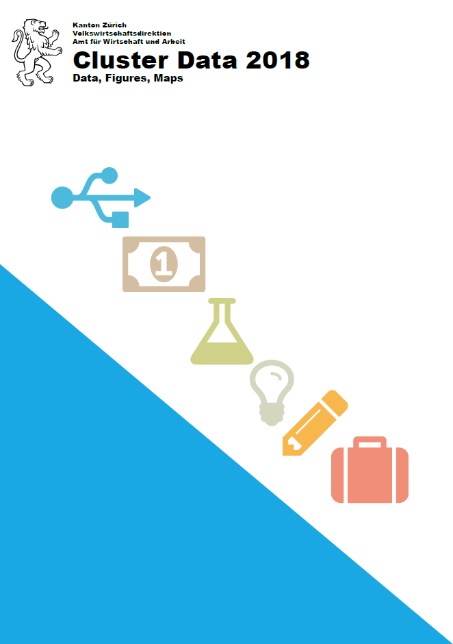
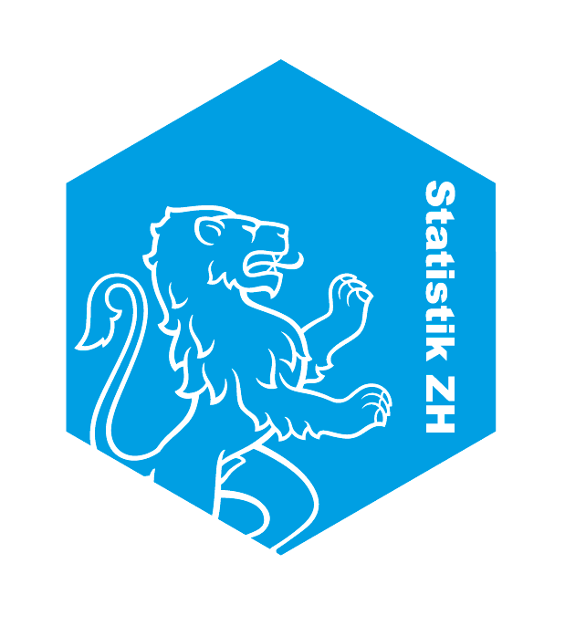

```{r setup, include=FALSE}
htmltools::tagList(rmarkdown::html_dependency_font_awesome())
knitr::opts_chunk$set(echo = TRUE, eval = TRUE,warning = F, message = F)
```

```{r, echo = F, eval = F}

library(jsonlite)
library(icon)


```


class:  left, top
# Environment
<!-- `r icon::fa_building(size = 3, pull= "right")` -->


```{r, echo = F}
office <- c("Official Statistics", "Public Administration")
it <- c("closed up IT infrastructure", "very rigid firewall")
staff <- c("Excel natives","R training «on-the-job»")


```

```{r, echo = T, eval = F}
ls()
```

```{r, echo = F, eval = F}
noquote(ls())
```

<br>

## Office
```{r, echo = F, size = 15, eval = T}
noquote(office)
```

## IT
```{r, echo = F, size = 15, eval = T}
noquote(it)
```


## Users
```{r, echo = F, size = 15, eval = T}
noquote(staff)

```


---


class: top, left

# Workflow
<!-- `r icon::fa_cogs(size = 3, pull = "right")` -->


<!--  -->


<!-- <br> -->

<!--  -->

<!-- <br> -->
<!-- .right[[Source: https://dataingovernment.blog.gov.uk](https://dataingovernment.blog.gov.uk/2017/03/27/reproducible-analytical-pipeline/)] -->


.pull-left[
### Today
- Data store  
`r icon::fa_table(size = 2)` `r icon::fa_file_excel(size = 2)` `r icon::fa_database(size = 2)`

- Statistical Analysis  
`r icon::fa_file_excel(size = 2)`  `r icon::fa_r(size = 2)` 

- Visualizations  
`r icon::fa_chart_bar(size = 2)` `r icon::fa_chart_pie(size = 2)` `r icon::fa_chart_line(size = 2)`

- Text  
`r icon::fa_file_word(size = 2)`  

- Publication  
`r icon::fa_file_pdf(size = 2)`
]

.pull-right[
### Tomorrow: Pipeline
]

---


class:  left, top
# Mission
<!-- `r icon::fa_trophy(size = 3, pull= "right")` -->
## Reproducible Analytical Pipelines

<br>

### GOV.UK Data in Government

[**Transforming the process of producing official statistics**](https://dataingovernment.blog.gov.uk/2017/11/27/transforming-the-process-of-producing-official-statistics/)

[**Reproducible Analytical Pipelines**](https://dataingovernment.blog.gov.uk/2017/03/27/reproducible-analytical-pipeline/)

[**RAP Companion**](https://ukgovdatascience.github.io/rap_companion/)


.right[]


---

class: top, left

# How to get there?
`r icon::fa_location_arrow(size = 3, pull = "right")`

<br>
## Tools

`r icon::fa_wrench(size = 5)`

<br>

## Culture

`r icon::fa_people_carry(size = 5)`


---

class: top, left

# Tools
`r icon::fa_database(size = 3, pull = "right")`
## Data storage

<br>
### Data base
```{r, eval = F, echo = T}
library(ROracle)
dbReadTable()
dbWriteTable()
```

```{r, eval = F, echo = F}
library(dbplyr)
```

.pull-left[
`r icon::fa_plus(size = 3, pull = "left")`
- traceable
- secure
- less redundancy
]

.pull-right[
`r icon::fa_minus(size = 3, pull = "left")`
- how to
- error handling (encoding, time zone)
]

---

class: top, left

# Tools
## Corporate Design Toolbox
```{r, echo = T, eval = F}
library(statR)
```

.pull-left[
### Colors, ggplot theme
```{r, echo = F, warning = F, message = F, fig.height=3.5, fig.width=4.5, eval = F}
ls("package:statR")
library(ggplot2)
# library(gridExtra)
library(statR)

source("L:/STAT/03_AS/01_Werkzeuge/01_Toolbox/R/Funktionen/theme_stat2.r")

# display(zhpal$zhdiagonal)

ggplot(mpg, aes(class))+
  geom_bar(aes(fill = drv))+
  theme_stat2()+
  scale_fill_manual(values = zhpal$zhpaired)+
  theme(plot.margin = unit(c(0, 0, 0, 0), "mm"))

```
.center[]
<!-- ### Excel Formatting  -->
<!-- .center[] -->
]

.pull-right[

### RMarkdown template

```{r, fig.height=3, echo = F, eval = F}
ggplot(mpg, aes(class))+
  geom_bar(aes(fill = drv))+
  theme_stat2()+
  scale_fill_manual(values = zhpal$zhpaired)+
  labs(title = " color palette & ggplot theme", fontfamily = "Arial Black")
```
.center[]
]


---


class: top, left

# Tools

<!-- `r icon::fa_step_forward(size = 3, pull = "right")` -->

## Next steps

<br>
### R
`r icon::fa_r(size = 2, pull = "right")`
- RProjects
- RPackages


### Dependencies
`r icon::fa_sitemap(size = 2, pull = "right")`
- docker is too heavy
- packrat vs. checkpoint
- is drake an option?


### Infrastructure
`r icon::fa_server(size = 2, pull = "right")`
- RStudio Server
- Git/Github


---

class: top, left

# Tools
`r icon::fa_times(size = 3, pull = "right")`
## Resistance


<br>

```{r, echo = F, warning = F, eval = T, fig.height=2, fig.width=8, eval = F}
library(tidyverse)
source("L:/STAT/03_AS/01_Werkzeuge/01_Toolbox/R/Funktionen/theme_stat.r")
user <- data.frame(variable = c("enthusiasts", "traditionalists"), value = c(25, 75) )

ggplot(user, aes(x = 1,y = value))+
  geom_bar(aes(fill = rev(variable)), position = "fill", stat = "sum", color= "black")+
  geom_text(aes(label = paste0(variable, "  ")), 
            color = "white", position = position_fill(), hjust = 1, vjust = -1, fontface= "bold", size = 7)+
    geom_text(aes(label = paste0(paste0(value, "%"), "  ")), 
            color = "white", position = position_fill(), vjust = 1, hjust = 1, fontface= "bold", size = 7)+
  theme_stat()+
  scale_fill_manual(values = c(zhpal$zhblue[4], zhpal$zhblue[1]))+
  theme(panel.grid = element_blank(),
        axis.text.y = element_blank(),
        legend.position = "none",
        plot.title = element_text(size = 20, face = "bold", hjust = 0.5),
        axis.text.x = element_blank(), axis.line.x = element_blank(),
        axis.ticks.x = element_blank())+
  coord_flip()+
    labs(x = NULL, y = NULL,  fill = NULL, color = NULL, title = "R User")+
  guides(color = NULL, fill = NULL)
```

.center[]


---

class: inverse, middle
# 

<font color="white" size = "66"> <b> It's the Culture, Stupid!  </b></font> 

`r icon::fa_users(size = 5, pull = "right")`

---

class: top, left

# Culture
`r icon::fa_bullhorn(size = 3, pull = "right")`
## Show & Tell

<br>

### In person: Internal Meetups
- Solve problems
- New R Packages
- Ideas & inspiration

<br>

### Virtual: Forum
- How To
- Code snippets
- Q & A

---


class: top, left

# Culture
`r icon::fa_users(size = 3, pull = "right")`

## Community


<font color=#009ee0 size = "20">  «The use of R in public administration» </font> 

.pull-left[]
.pull-right[
<br>
.right[https://statistikzh.github.io/RMeetup]]  


---
class: top, left

# Culture
## Skills


<br>
.center[`r icon::fa_user_ninja(size = 5 )`]


<br>

.pull-left[
`r icon::fa_plus(size = 3, pull = "left")`
  - functions
  - Code review
  - Code style guide]
.pull-right[
`r icon::fa_minus(size = 3, pull = "left")`
  - copy & paste
  - loooooong R scripts
  - tool frictions]
---


class: inverse, center


`r icon::fa_road(size = 5)`

<br>

.center[
<!-- <i class="fas fa-road", size = 9></i> -->

<!-- <br> -->

<font color=white size = "20"> <b>  Reproducibility </b> </font> 

<br>

<font color=white size = "20"> <b>  Cooperation </b> </font> 


<br>

<font color=white size = "20"> <b>  Pace setting </b> </font> ]


---


background-image: url("libs/sticker-01.png")
background-position: bottom right
background-size:30%

class: top, left

`r icon::fa_comments(size = 5, pull = "right")`

<font color=#009ee0 size = "48"> <b> Your experiences? 
<br>
<br> Thanks! </b></font> 

<br>
<br>

Andrea Schnell   
[andrea.schnell@statistik.ji.zh.ch](mailto:andrea.schnell@statistik.ji.zh.ch)  

`r icon::fa_twitter(size = 2)` <a href="https://twitter.com/statistik_zh?ref_src=twsrc%5Etfw" class="twitter-follow-button" data-show-count="false">@schnllr</a><script async src="https://platform.twitter.com/widgets.js" charset="utf-8"></script>

`r icon::fa_github(size = 2)` https://schnllr.github.io/eRum  

<!-- <br> -->
<!-- Statistical Office Canton of Zurich   -->

<!-- `r icon::fa_twitter(size = 1)` <a href="https://twitter.com/statistik_zh?ref_src=twsrc%5Etfw" class="twitter-follow-button" data-show-count="false">@statistik_zh</a><script async src="https://platform.twitter.com/widgets.js" charset="utf-8"></script> -->


<br>
<small>Slides created via the R package [**xaringan**](https://github.com/yihui/xaringan).</small>


<!-- .right[] -->
